<div align="center">

# 💻 Campus Life Admin

<!-- 动态打字机效果 -->
<a href="https://github.com/lxxxDD/campus-life-admin">
  
</a>

<!-- 核心徽章 -->
<p>
  
  
  
  
</p>

<!-- 仓库徽章 -->
<p>
  <a href="https://github.com/lxxxDD/campus-life-admin">
    
  </a>
  <a href="https://github.com/lxxxDD/campus-life-admin/stargazers">
    
  </a>
  <a href="https://github.com/lxxxDD/campus-life-admin/commits">
    
  </a>
</p>

<!-- 星际传送门 -->
<div align="center">
  <table>
    <tr>
      <td align="center" width="200">
        <a href="https://github.com/lxxxDD/campus-life-admin">
          
        </a>
        <br>
        <b>CampusLifeAdmin</b>
        <br>
        <sub>运筹帷幄的指挥中心</sub>
      </td>
      <td align="center" width="50">⚡</td>
      <td align="center" width="200">
        <a href="https://github.com/lxxxDD/campus-life-server">
          
        </a>
        <br>
        <b>CampusLifeServer</b>
        <br>
        <sub>数据中枢 & 业务大脑</sub>
      </td>
      <td align="center" width="50">⚡</td>
      <td align="center" width="200">
        <a href="https://github.com/lxxxDD/campus-life-app">
          
        </a>
        <br>
        <b>CampusLifeApp</b>
        <br>
        <sub>触手可及的校园生活</sub>
      </td>
    </tr>
  </table>
</div>

<h3>🎛️ 掌控全局，运筹帷幄</h3>

<p>
  <a href="#-界面预览">🖥️ 界面预览</a> •
  <a href="#-技术全景">🔭 技术全景</a> •
  <a href="#-核心模块">🧩 核心模块</a> •
  <a href="#-快速部署">🚀 快速部署</a>
</p>

</div>

---

## 🖥️ 界面预览 (Dashboard)

```
┌─────────────────────────────────────────────────────────────────┐
│  🎓 Campus Admin                        🔔  👤 Admin  ⚙️        │
├──────────┬──────────────────────────────────────────────────────┤
│          │                                                      │
│ 📊 看板  │  ┌────────────┐  ┌────────────┐  ┌────────────┐      │
│ 👥 用户  │  │ 👥 用户总量 │  │ 📦 今日订单 │  │ 💰 总交易额 │      │
│ 🛒 市场  │  │   12,345   │  │     567    │  │   ¥89,000  │      │
│ 🍜 餐饮  │  │   ↗️ 12%    │  │    ↗️ 5%    │  │    ↗️ 8%    │      │
│ 🔧 报修  │  └────────────┘  └────────────┘  └────────────┘      │
│ 📅 活动  │                                                      │
│ ⚙️ 设置  │  ┌────────────────────────────────────────────────┐  │
│          │  │                 📈 流量趋势图                   │  │
│          │  │       ╭─╮       ╭──╮                           │  │
│          │  │   ╭───╯ ╰───────╯  ╰────╮      ╭───────────    │  │
│          │  │ ──╯                     ╰──────╯               │  │
│          │  └────────────────────────────────────────────────┘  │
│          │                                                      │
└──────────┴──────────────────────────────────────────────────────┘
```

## 🔭 技术全景 (Tech Panorama)

```mermaid
graph TD
    Root(("💻 Admin System"))
    
    Root --> Framework("⚛️ 核心框架")
    Framework --> Vue("Vue 3 (Setup)")
    Framework --> Vite("⚡ Vite 5")
    
    Root --> UI("💅 UI系统")
    UI --> Element("🔵 Element Plus")
    UI --> Tailwind("🌬️ Tailwind CSS")
    UI --> Icon("🎭 Iconify")
    
    Root --> Data("🌊 数据流")
    Data --> Pinia("🍍 Pinia")
    Data --> Router("🛣️ Vue Router")
    Data --> Axios("📡 Axios")
    
    Root --> Viz("📊 可视化")
    Viz --> ECharts("📈 ECharts 5")
    Viz --> DataV("📉 DataV")
    
    Root --> Eng("⚙️ 工程化")
    Eng --> ESLint("🔍 ESLint")
    Eng --> Prettier("✨ Prettier")
    Eng --> Husky("🐶 Husky")

    %% Neon Cyberpunk Palette
    style Root fill:#000,stroke:#fff,stroke-width:4px,color:#fff
    
    style Framework fill:#000,stroke:#ff00ff,stroke-width:2px,color:#ff00ff
    style Vue fill:#000,stroke:#ff00ff,stroke-width:1px,color:#fff
    style Vite fill:#000,stroke:#ff00ff,stroke-width:1px,color:#fff
    
    style UI fill:#000,stroke:#00ffff,stroke-width:2px,color:#00ffff
    style Element fill:#000,stroke:#00ffff,stroke-width:1px,color:#fff
    style Tailwind fill:#000,stroke:#00ffff,stroke-width:1px,color:#fff
    style Icon fill:#000,stroke:#00ffff,stroke-width:1px,color:#fff
    
    style Data fill:#000,stroke:#ffff00,stroke-width:2px,color:#ffff00
    style Pinia fill:#000,stroke:#ffff00,stroke-width:1px,color:#fff
    style Router fill:#000,stroke:#ffff00,stroke-width:1px,color:#fff
    style Axios fill:#000,stroke:#ffff00,stroke-width:1px,color:#fff
    
    style Viz fill:#000,stroke:#00ff00,stroke-width:2px,color:#00ff00
    style ECharts fill:#000,stroke:#00ff00,stroke-width:1px,color:#fff
    style DataV fill:#000,stroke:#00ff00,stroke-width:1px,color:#fff
    
    style Eng fill:#000,stroke:#ff9900,stroke-width:2px,color:#ff9900
    style ESLint fill:#000,stroke:#ff9900,stroke-width:1px,color:#fff
    style Prettier fill:#000,stroke:#ff9900,stroke-width:1px,color:#fff
    style Husky fill:#000,stroke:#ff9900,stroke-width:1px,color:#fff
    
    linkStyle default stroke:#666,stroke-width:1px
```



## 🧩 核心模块 (Modules)

| 模块 | 功能描述 | 状态 |
| :--- | :--- | :---: |
| **📊 数据看板** | 实时数据监控、多维度报表分析 | ✅ |
| **👥 用户管理** | 用户画像、权限控制、实名审核 | ✅ |
| **🛒 市场监管** | 商品审核、违规处理、交易纠纷 | ✅ |
| **🍜 餐饮运营** | 菜品管理、订单调度、营收统计 | ✅ |
| **🔧 报修调度** | 工单分配、技师管理、绩效考核 | ✅ |
| **⚙️ 系统配置** | 角色权限(RBAC)、操作日志审计 | ✅ |

## 🚀 快速部署 (Deployment)

### 📦 本地开发

```bash
# 1. 克隆仓库
git clone https://github.com/lxxxDD/campus-life-admin.git

# 2. 安装依赖
pnpm install  # 推荐使用 pnpm

# 3. 启动服务
pnpm dev
```

### 🐳 Docker 部署

```bash
# 构建镜像
docker build -t campus-admin .

# 运行容器
docker run -d -p 80:80 campus-admin
```

## 🔗 生态系统 (Ecosystem)

<div align="center">

| 项目 | 描述 | 技术栈 |
|:---:|:---|:---:|
| [](https://github.com/lxxxDD/campus-life-server) | RESTful API服务 | Spring Boot |
| [](https://github.com/lxxxDD/campus-life-app) | 跨平台移动应用 | uni-app |
| [](https://github.com/lxxxDD/campus-life-admin) | 运营管理系统 | Vue 3 |

</div>

---

<div align="center">

**Made with 💙 by [lxxxDD](https://github.com/lxxxDD)**

</div>
