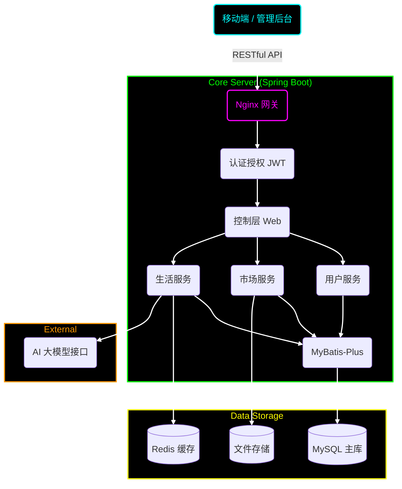
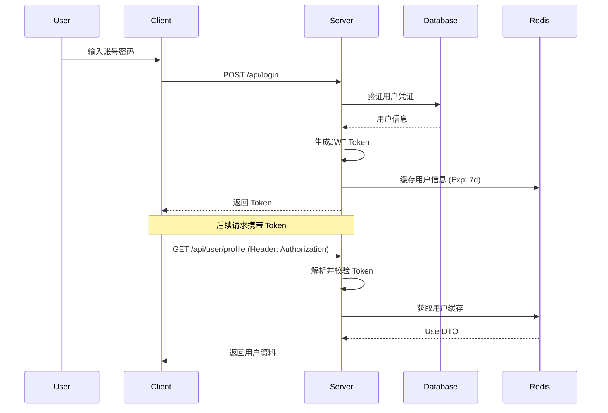
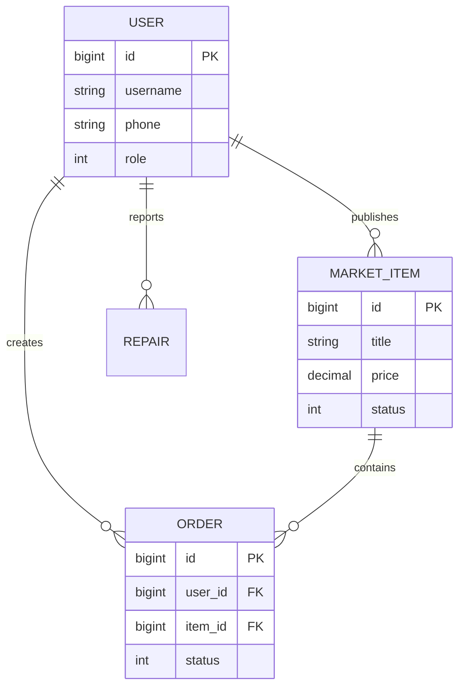
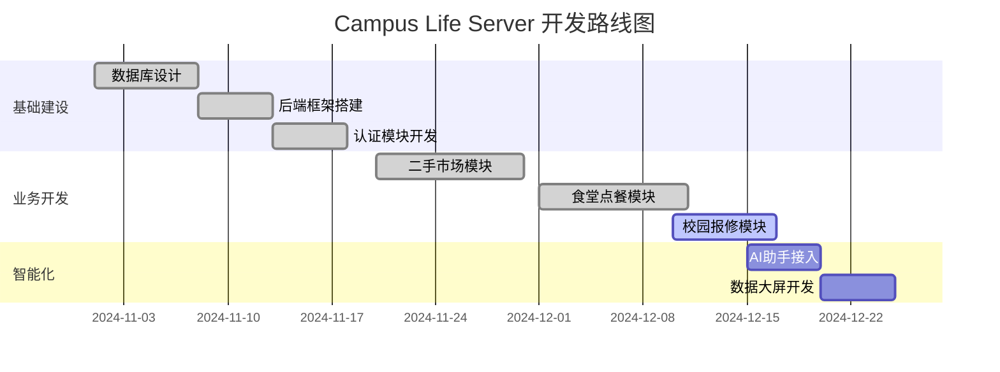

<div align="center">

# 🎓 Campus Life Server

<!-- 动态打字机效果 -->
<a href="https://github.com/lxxxDD/campus-life-server">
  
</a>

<!-- 技术栈徽章 -->
<p>
  
  
  
  
  
  
</p>

<!-- 仓库徽章 -->
<p>
  <a href="https://github.com/lxxxDD/campus-life-server">
    
  </a>
  <a href="https://github.com/lxxxDD/campus-life-server/stargazers">
    
  </a>
  <a href="https://github.com/lxxxDD/campus-life-server/commits">
    
  </a>
</p>

<!-- 星际传送门 -->
<div align="center">
  <table>
    <tr>
      <td align="center" width="200">
        <a href="https://github.com/lxxxDD/campus-life-server">
          
        </a>
        <br>
        <b>CampusLifeServer</b>
        <br>
        <sub>数据中枢 & 业务大脑</sub>
      </td>
      <td align="center" width="50">⚡</td>
      <td align="center" width="200">
        <a href="https://github.com/lxxxDD/campus-life-app">
          
        </a>
        <br>
        <b>CampusLifeApp</b>
        <br>
        <sub>触手可及的校园生活</sub>
      </td>
      <td align="center" width="50">⚡</td>
      <td align="center" width="200">
        <a href="https://github.com/lxxxDD/campus-life-admin">
          
        </a>
        <br>
        <b>CampusLifeAdmin</b>
        <br>
        <sub>运筹帷幄的指挥中心</sub>
      </td>
    </tr>
  </table>
</div>

<h3>🚀 让校园生活从未如此极客</h3>

<p>
  <a href="#-系统架构">🗺️ 系统架构</a> •
  <a href="#-核心功能">⚡ 核心功能</a> •
  <a href="http://localhost:8080/doc.html">📖 接口文档</a> •
  <a href="#-快速开始">� 快速开始</a>
</p>

</div>

---

## 🗺️ 系统架构 (System Architecture)



## 🧬 核心流程 (Core Process)

<details>
<summary><b>🔐 点击查看：JWT认证鉴权时序图</b></summary>
<br>



</details>

## 💾 数据模型 (ER Diagram)

<details>
<summary><b>🗄️ 点击查看：核心业务ER关系图</b></summary>
<br>



</details>

## 📅 开发计划 (Roadmap)



## ⚡ 核心能力 (Core Capabilities)

| 领域 | 核心功能 | 技术实现 |
| :--- | :--- | :--- |
| **🔐 安全架构** | JWT无状态认证、RBAC权限模型 | `HandlerInterceptor`, `@CheckToken` |
| **🚀 高性能** | 多级缓存架构、连接池优化 | `Redis`, `HikariCP` |
| **💬 即时通讯** | WebSocket全双工通信 | `ServerEndpoint` |
| **🤖 AI集成** | 智能对话上下文管理 | `OkHttp`, `SSE` |
| **📝 文档工程** | 自动化接口文档 | `Knife4j`, `Swagger 3` |

## 🚀 极速部署 (Quick Start)

```bash
# 1. ⬇️ 下载神器的源代码
git clone https://github.com/lxxxDD/campus-life-server.git

# 2. 🚀 进入发射基地
cd campus-life-server

# 3. 💣 装填弹药 (数据库)
# 执行 sql/init.sql 初始化数据库结构

# 4. ⚙️ 调整参数
# vim src/main/resources/application.yml

# 5. 🔥 点火发射！
mvn spring-boot:run
```

## 🤝 贡献者 (Contributors)

<a href="https://github.com/lxxxDD/campus-life-server/graphs/contributors">
  
</a>

---

<div align="center">

**Code with ☕ and ❤️**

[](https://star-history.com/#lxxxDD/campus-life-server&Date)

</div>

